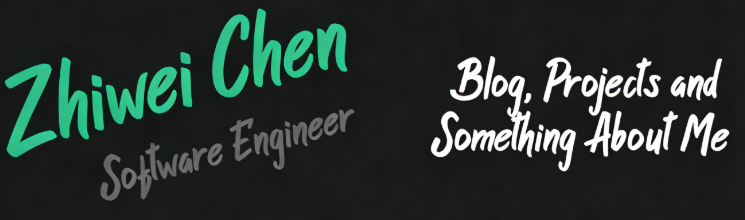

# Hi, I'm Chen Zhiwei! 

  <em>
    Artificial Intelligence at 
    <a href="https://www.nuist.edu.cn/" 
      title="Nanjing University of Information Science and Technology"
      target="_blank" rel="noopener noreferrer">
      NUIST
    </a>
    
     
    Applied Computing at 
    <a href="https://www.setu.ie/" 
      title="South East Technology University"
      target="_blank" rel="noopener noreferrer">
      SETU
    </a>
    
  </em>

## About Me
I am a computer science student interested in cloud computing and security.

## Projects
- **KServe Deployment Lab** – Deployed ML model on Kubernetes
- **Android UI Design** – Room style selection app

## Contact
- GitHub: https://github.com/username
- Email: you@example.com
